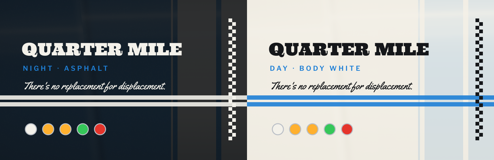

<p align="center"></p>

<p align="center"><sub>There's no replacement for displacement.</sub></p>

# ● QUARTER MILE

The drag strip as a desktop. **The tree is the only status grammar**: white is staged, amber is the countdown (soon, due today, the adhan), green is go (focused, up, the iqama), red is a foul (failed, overdue, urgent); an unlit outline means nothing is there. The forms are the twin hood stripes, the chequer and chrome rings; nothing is cut on a slant. No car, badge, brand or model name appears anywhere.

| | |
|---|---|
| **quartermile-night** | asphalt with stripe-white lettering |
| **quartermile-day** | body white with body-blue stripes and ink lettering |

## ○ Staged · the paint

| | | |
|---|---|---|
| **ground** | `#101113 / #F2EFE6` | night / day |
| **text** | `#F3F1EA / #15171A` |  |
| **body blue** | `#1E7FD6` | the paint |
| **chrome** | `#B9BEC6` | rings, bezels |
| **amber** | `#FFB02E` | the countdown |
| **green** | `#35C759` | go |
| **red** | `#E5342B` | foul |

## ● Amber · the build

- **Windows**: rounding 5, a 1px focused border, one dark shadow, no glow
- **Waybar**: three chrome-bezelled pods; the twin stripes run along each and end in
  a chequer; workspaces are tree bulbs
- **mawaqit**: a banner crossed by the stripes with a three-lamp tree, both ambers for
  the adhan, green for the iqama
- **yawm**: ● overdue (red), ● today (amber), ● later, ○ undated, ¶ notes
- **hyprlock**: the clock as an elapsed time on a scoreboard, the starting tree on the
  wallpaper's stripes, the line in Yellowtail
- **QuartermileNightTree / QuartermileDayTree** cursors (busy is the tree counting
  down), matching icons, **GTK / Thunar**, **swaync**
- **Terminals**: Source Code Pro 10.5; tmux and zsh join their plates with a chequer
- **Type**: Ultra, Yellowtail, Bungee, Libre Franklin, Courier Prime, Source Code Pro,
  Lalezar

## ● Pre-stage · what you need

- Arch Linux (the package check uses `pacman`)
- Hyprland 0.56 or newer: the configuration is written in Lua
- waybar 0.15 or newer
- the packages in `quartermile-night/packages.txt` (both variants need the same):

```sh
sudo pacman -S --needed $(grep -v '^#' quartermile-night/packages.txt)
```

## ● Green

> [!WARNING]
> This is a whole desktop, not a colour scheme. It replaces every file listed
> in `quartermile-night/MANIFEST` or `quartermile-day/MANIFEST`: the Hyprland, waybar, terminal, tmux, GTK and fontconfig
> configuration among them, and the theme line in `~/.zshrc`.
> Everything it replaces is backed up first.

```sh
git clone https://github.com/houssemMekhelbi/quartermile.git
cd quartermile
./quartermile-night/restore.sh --dry-run   # show what would change, touch nothing
./quartermile-night/restore.sh             # apply quartermile-night
./quartermile-day/restore.sh               # or quartermile-day
```

`restore.sh` then:

1. reports missing packages;
2. backs up every path it is about to replace to `~/themes/.backups/before-<variant>-<timestamp>/`;
3. copies the theme's `home/` over `$HOME` and removes the paths in its `ABSENT`;
4. points `~/.zshrc` at the theme's prompt;
5. applies its `gsettings.txt` and refreshes the font and icon caches;
6. builds the mawaqit-api image if it is missing, enables the user services and
   reloads Hyprland, waybar, hyprpaper, swaync and tmux.

`--files-only` copies the files and gsettings and leaves the services alone.

## ● Red · back to the lanes

Copy the backup folder back over `$HOME`.

## ○ Prayer times

Prayer times come from [mawaqit.net](https://mawaqit.net) through a local copy of
[mawaqit-api](https://github.com/mrsofiane/mawaqit-api), run by podman on 127.0.0.1.
List your mosques in `~/.config/mawaqit/mosques`, one `<mawaqit.net slug> | <label>`
per line; scroll or right-click the prayer module to switch between them.

## ○ Other lanes

This is one of the hattin themes. They share one behaviour (binds, workspaces,
bar modules) and differ only in look. Clone several side by side and run the
`restore.sh` of the one you want: each switch removes what the previous theme
left that the new one does not use.

## ○ Timeslip · licence

MIT, see [LICENSE](LICENSE). The fonts in `<theme>/home/.local/share/fonts/` are
under the SIL Open Font License, except Ultra and Yellowtail (Apache License 2.0); each licence text sits next to its font.
mawaqit-api (`<theme>/home/.local/share/mawaqit-api/`) is MIT, © Sofiane Louchene.
